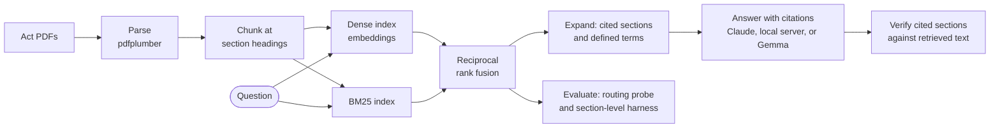

<div align="center">

# Legal RAG Evaluation

### Hybrid retrieval over Australian statute, built around the Fair Work Act and modern awards

    

</div>

<br>

> Legislation is hard to retrieve from.  Provisions cite one another and defined terms reach across pages, so a chunk cut in the wrong place loses the meaning it depends on.  This pipeline keeps section boundaries intact, pairs vector search with keyword matching, and brings in the sections and definitions that a retrieved provision depends on.  **It also says plainly which of its numbers mean something.**

<br>

## What it is

A retrieval-augmented generation (**RAG**) pipeline for Australian workplace law.  It parses PDFs of legislation into section-sized chunks, builds a hybrid index, answers questions with sources through a chat interface, and scores its own retrieval with precision, recall, MRR, and MAP.

Embeddings come from OpenAI or any local OpenAI-compatible server.  Answers come from a local server, a local Gemma checkpoint, or Claude, which cites the exact retrieved text it relies on.  The whole pipeline can therefore run end to end with no commercial key.

> [!CAUTION]
> This gives no legal advice and is not a production tool.  It ships no documents, so you supply your own PDFs.

It is a working prototype.  The tests cover the chunker, retrieval expansion, the menu and chat, the answer clients, the import path, and the metric conventions, and CI runs them with ruff on Python 3.10 and 3.13.  The pipeline itself is verified by running it, and one such run is committed below.

<br>

## Results

This is a real run, done on one machine with no commercial key.  [results/PROVENANCE.md](results/PROVENANCE.md) records the inputs, the compilation numbers of the two Acts, and the commands to reproduce it, and the small output files are checked in under `results/`.

The corpus is two Commonwealth Acts, chosen because they are short and clearly distinct.  Indexing them produced **247 chunks**, 104 from the *Spam Act 2003* (Cth) and 143 from the *Do Not Call Register Act 2006* (Cth).

> [!IMPORTANT]
> This run predates the rewritten chunker, which cuts each Act at different places.  The run has not been repeated with the current code, so the figures below describe the earlier version.

### Retrieval

Eight cross-Act questions were written by hand before any retrieval ran, and each was labelled with the Act that answers it.  The probe asks only whether the hybrid retriever sends each query to the right Act.

| Measure | Result |
|---|:--:|
| Correct Act at rank 1 | **7 / 8** |
| Correct Act within the top 3 | **8 / 8** |

The single miss at rank 1 is a civil-penalty question.  Both Acts impose civil penalties, so the top hit is defensibly ambiguous, and the right Act still appears at ranks 2 and 3.  See `results/retrieval_probe.json`.  This is document-level routing on eight points.  It is not a benchmark and says nothing about accuracy at section level or on open questions.

### Generation

Two questions went through the full path of retrieval, prompt, and generation against a local OpenAI-compatible model.  One produced a correctly cited answer, pointing to s 11 of the *Do Not Call Register Act 2006* (Cth) for the prohibition and s 10 for the outline.  The other declined.  Its top chunks did not surface the operative provision, and the assistant reported that instead of inventing a citation.  See `results/chat_demo.json`.

> [!WARNING]
> The built-in evaluation numbers are not the headline.  Of the 100 queries `evaluate.py` generates, 40 are templates filled from sampled chunks, and each marks every chunk of its source Act relevant.  The other 60 are Fair Work Act questions written into the code, and on this corpus, which holds no Fair Work Act, they have no relevant chunk at all.  The metric code scores such a query as recall 1.0 and MAP 1.0 by convention, so recall@1 cannot fall below 0.60 and precision@1 cannot rise above 0.40, whatever the retriever does.  The printed figures for this run (recall@1 0.60, MAP 0.62, precision@1 0.36) describe the query generator rather than retrieval quality.  [results/PROVENANCE.md](results/PROVENANCE.md) sets out the arithmetic, and `tests/test_eval_generator.py` and `tests/test_eval_metrics.py` pin the behaviour down.

<br>

## Grounded answers with Claude

With `CHAT_BACKEND=claude`, each retrieved chunk goes to Claude as its own document, titled with the Act and the provision, such as "Do Not Call Register Act 2006, s 11", with citations switched on.  Claude's answer comes back with the exact span of each document it relies on, so every citation points at text that was actually retrieved.  The chat prints those passages under the answer.

| Setting | Value |
|---|---|
| Model | `claude-opus-5-5` by default, or `CLAUDE_MODEL` |
| Effort | `high` by default, or `CLAUDE_EFFORT`.  Opus 5.5 always thinks adaptively, so effort is the setting that trades depth for cost and speed. |
| Sampling | No temperature or top-p.  Opus 5.5 rejects them, so repeated runs vary. |
| Refusals | A refusal is reported as a refusal, with its category, never as an answer.  A truncated answer says it was cut off. |
| Fallback | Server-side fallback is on, because this is a chat answer for a person.  If Opus 5.5's safety classifiers decline a question, the API reruns it on the model Anthropic recommends for that refusal category, and the answer records that a fallback model served it. |
| Price | $4 per million input tokens and $20 per million output tokens for Opus 5.5.  No cost per question has been measured here. |

```bash
export ANTHROPIC_API_KEY='sk-ant-...'
python -m legal_rag.chat --backend claude
python -m legal_rag.pipeline --mode chat --backend claude --query "May a telemarketer call a number on the Register?"
```

> [!NOTE]
> The Claude path has not been run against the live API from this repository.  The tests drive the real `anthropic` SDK against a mocked HTTP transport, including responses with citations, a refusal, a truncated answer, and a fallback.  The commands above are what to run with a key.

<br>

## How it works




| Component | Approach |
|---|---|
| **Legal-aware chunking** | Cuts each Act at the section headings that start a line, so a section that crosses a page break stays in one chunk.  No text is dropped, contents entries and running headers are not mistaken for headings, and schedule clauses are labelled with their schedule. |
| **Hybrid retrieval** | Combines dense vector similarity with BM25 keyword matching through reciprocal rank fusion. |
| **Cross-reference expansion** | After retrieval, adds up to three sections of the same Act that the retrieved sections cite, such as "section 12" or "Schedule 2".  A reference to another Act is not followed.  Each added chunk is marked as added and scores below everything retrieved. |
| **Defined-term expansion** | Indexes every term an Act defines.  When a defined term appears in the question or in a retrieved section, adds the chunk that defines it, or the section its definition points to, up to three per question. |
| **Citation check** | After every answer, from any backend, reads the provisions it cites, such as "s 11(1)", "ss 16-17", or "Schedule 2".  It reports which were in the retrieved text, which exist in the indexed Acts but were not retrieved, and which are not in the indexed Acts at all, and the chat prints the result under the sources.  It shows whether a cited provision was in front of the model, not whether the answer reads it correctly. |

### Design decisions

Legal questions need both kinds of search.  "What is unfair dismissal" is a semantic question that vector search handles well.  "Section 340(1)" is an exact string that BM25 finds and vector search often misses.  Fusing the two covers both kinds of query.

Fixed-size chunking breaks provisions mid-section and makes chunks whose meaning depends on text outside them.  The chunker instead cuts at section headings, so each section becomes one unit, and splits a section longer than 2,000 characters at its subsections, with every piece keeping the section number.

<br>

## Quick start

You need Python 3.10 or later, and your own PDFs.  The repository ships no documents, so put the legislation you want to index in `data/raw/`, which git ignores.

Embeddings and chat answers can come from either of two places.  The hosted path uses an OpenAI API key, with embeddings from `text-embedding-3-large`.  The fully local path uses any OpenAI-compatible embedding server and any OpenAI-compatible chat server, and needs no commercial key.  Only the built-in Gemma path needs a GPU, and it runs on CUDA, Apple MPS, or slowly on CPU.

### 1. Install

```bash
pip install -e ".[gemma]"   # drop [gemma] if you will not run the local Gemma model
```

This installs one package, `legal_rag`, and a `legal-rag` command that opens the interactive menu.

### 2. Choose a backend

Point the OpenAI client at a server with the standard environment variables.  Local servers ignore the key, so any placeholder value works.

```bash
# Option A, hosted OpenAI for both embeddings and chat
export OPENAI_API_KEY='sk-...'

# Option B, fully local, with embeddings and chat from OpenAI-compatible servers
export OPENAI_API_KEY=local
export OPENAI_BASE_URL=http://localhost:10001/v1   # embeddings
export CHAT_BASE_URL=http://localhost:10009/v1     # chat generation
export CHAT_MODEL=<model-name-served-there>

# Option C, Claude answers with citations (embeddings still use option A or B)
export ANTHROPIC_API_KEY='sk-ant-...'
export CHAT_BACKEND=claude           # or pass --backend claude
export CLAUDE_EFFORT=high            # low, medium, high, xhigh, or max
```

With `CHAT_BASE_URL` set, generation uses the OpenAI-compatible client.  Without it, generation falls back to a local Gemma checkpoint loaded with `transformers`, `google/gemma-4-12B-it` unless `GEMMA_MODEL` names another.  A GGUF file cannot be loaded that way, so serve it with llama.cpp or a similar server and set `CHAT_BASE_URL` instead.  If the checkpoint fails to load, the chat stops with the error rather than answering.  Embeddings always come from `OPENAI_BASE_URL`, which defaults to OpenAI.

### 3. Run the tests

The tests run in an environment of their own, apart from the full install in step 1.

```bash
pip install -r requirements-dev.txt
pytest
```

`requirements-dev.txt` holds `pytest` and the light packages the pipeline imports when it loads.  It leaves out `torch` and `transformers` on purpose.  One test imports the pipeline in a fresh interpreter and checks that neither was loaded, so the suite passes with or without the full install.

<br>

## Usage

### Interactive CLI

```bash
legal-rag      # or ./fairwork from the project root, without installing
```

The menu walks through choosing PDFs, an embedding model, and output folders, so no flags are needed.

| Key | Action | What it does |
|:--:|---|---|
| `1` or `p` | Process | Parses the chosen PDFs and builds the retrieval index |
| `2` or `q` | Query | Searches the index for relevant passages |
| `3` or `c` | Chat | Answers questions from the index, with sources |
| `4` or `e` | Evaluate | Generates a test set and scores retrieval against it |
| `0` or `5` | Quit | Leaves the CLI.  Typing `q` opens Query, so quit with `0`. |

### Scripted commands

```bash
# Parse PDFs into chunks and build the index
python -m legal_rag.pipeline --mode process --pdfs data/raw/fair_work_act_2009.pdf --output-dir data/processed

# Search the index
python -m legal_rag.pipeline --mode query --query "What is the definition of employee?" --k 10 --load-index

# Chat over the index
python -m legal_rag.chat --load-index
```

Processing writes `data/processed/chunks.json` and an embedding index at `data/processed/embeddings/fairwork_index_index.json`.  The PDF path above is only an example, so point `--pdfs` at your own documents in `data/raw/`.

### Evaluation

```bash
python -m legal_rag.evaluate --pdfs data/raw/fair_work_act_2009.pdf --num-queries 100 --eval-dir evaluation_set
```

The runner generates three kinds of test query, with relevance labels assigned by rule rather than checked by a person.  Read the warning under [Results](#results) before relying on its scores.  The report says how many queries had no relevant chunk.

| Query type | Share | How it is written | What counts as relevant |
|---|:--:|---|---|
| **Fact-based** | 40% | A template filled from a sampled chunk, such as "What is the definition of '<frequent word>' in the <Act>?" | Every chunk of the source Act |
| **Hypothetical** | 35% | Fair Work Act questions written into the code, such as "How much annual leave is an employee entitled to?" | Chunks of a document named `fair_work_act_2009` |
| **Cross-referencing** | 25% | Fair Work Act questions written into the code, such as "How do sections 31 and 32 interact regarding national employment standards?" | Chunks of a document named `fair_work_act_2009` |

| Metric | Meaning |
|---|---|
| **Precision@k** (k = 1, 3, 5, 10) | Share of retrieved chunks that are relevant.  The runner's 90% target applies to overall Precision@10. |
| **Recall@k** | Share of all relevant chunks that were retrieved |
| **MRR** | Mean reciprocal rank of the first relevant result |
| **MAP** | Mean average precision across all ranks |


### Section-level evaluation

The routing probe asks only whether the right Act comes back.  The section-level harness asks whether the right sections do.  Each question in a gold set names the Act and the sections that answer it, and the harness reports precision@k, recall@k, and MRR at section level, next to the probe's document-level hit rate, for k of 1, 3, 5, and 10.

[gold/fair_work_act_2009.json](gold/fair_work_act_2009.json) holds 36 draft questions on the *Fair Work Act 2009* (Cth), covering the National Employment Standards, termination and redundancy, general protections, unfair dismissal, bullying orders, and records.  Every gold section number was checked against the AustLII page for that section of the consolidated Act, and each question records that page as its source.

> [!IMPORTANT]
> The question set is provisional and needs the owner's review before any score on it is reported.  Neither the set nor the harness has been run.  The Act's PDF and an embedding model could not be reached from the environment where they were built, so there are no section-level numbers yet.

To run it, set the embedding variables from step 2 of the quick start, then:

```bash
# 1. Download the Act from the Federal Register of Legislation.  Its register
#    ID is C2009A00028.  Open the latest compilation's Downloads tab, such as
#    https://www.legislation.gov.au/C2009A00028/2025-11-07/downloads, and save
#    its PDF volumes as data/raw/fair_work_act_2009_vol1.pdf, _vol2.pdf, and so on.

# 2. Index the volumes.  Any file named fair_work_act_2009 or fair_work_act_2009_<suffix> counts as the Act.
python -m legal_rag.pipeline --mode process --pdfs data/raw/fair_work_act_2009_vol*.pdf --output-dir data/processed

# 3. Score retrieval against the gold set.  Writes results/section_eval_fair_work_act.json.
python -m legal_rag.evaluation.section_eval --gold gold/fair_work_act_2009.json
```

| Measure | Meaning |
|---|---|
| **precision@k** | Share of the top k chunks that belong to a gold section |
| **recall@k** | Share of the gold sections with at least one chunk in the top k |
| **MRR** | Mean reciprocal rank of the first chunk from a gold section |
| **Document hit@k** | Share of questions with a chunk from the right Act in the top k, as in the routing probe |

Retrieval is scored without cross-reference or definition expansion, and a chunk counts for every section whose heading falls inside it.

<br>

## Reference

### CLI flags

| Flag | Command | Default | Purpose |
|---|---|---|---|
| `--pdfs` | `pipeline.py` (process mode), `evaluate.py` | Required | PDF files to process |
| `--mode` | `pipeline.py` | `process` | `process`, `query`, or `chat` |
| `--query` | `pipeline.py` | None | Search query in query mode |
| `--k` | `pipeline.py` | `10` | Number of results in query mode |
| `--data-dir` | `pipeline.py`, `evaluate.py`, `chat.py` | `data` | Accepted, but no command reads from it yet |
| `--output-dir` | `pipeline.py`, `evaluate.py`, `chat.py` | `data/processed` | Directory for `chunks.json` and the index, which goes in its `embeddings/` folder |
| `--load-index` | `pipeline.py`, `chat.py` | Off | Loads an existing index instead of building one |
| `--index-name` | `pipeline.py`, `chat.py` | `fairwork_index` | Index name, saved as `<name>_index.json` |
| `--num-queries` | `evaluate.py` | `100` | Number of test queries to generate |
| `--eval-dir` | `evaluate.py` | `evaluation_set` | Directory for the generated test set and report |
| `--no-print` | `evaluate.py` | Off | Skips printing the report |
| `--embedding-model` | `pipeline.py`, `evaluate.py` | `text-embedding-3-large` | Embedding model to request from the OpenAI-compatible server |
| `--no-rag` | `chat.py` | Off | Starts the chat with retrieval off.  `/rag on` and `/rag off` switch it during the chat. |

### In code

`FairWorkRAGPipeline` accepts `output_dir` and `embedding_model` (default `text-embedding-3-large`).  Retrieval fuses the vector and BM25 rankings with reciprocal rank fusion, which has no weights to tune, so the unused `retrieval_alpha` and `retrieval_beta` options are gone.

### Stack

| Area | Libraries |
|---|---|
| **PDF parsing** | `pdfplumber` |
| **Keyword search** | `rank-bm25` |
| **Embeddings and hosted chat** | `openai` |
| **Claude answers with citations** | `anthropic` |
| **Local chat** | `transformers` running a Gemma checkpoint, `google/gemma-4-12B-it` by default |

<br>

## Layout

```text
legal-rag-evaluation/
  src/legal_rag/
    data_preprocessing/
      pdf_parser.py            Structure-preserving PDF parsing (pdfplumber)
      chunking.py              Legal-aware chunker that keeps section boundaries
      metadata_extractor.py    Cross-reference and definition detection
    embedding/__init__.py      EmbeddingModel (text-embedding-3-large) and EmbeddingManager (in-memory vectors, JSON index)
    retrieval/__init__.py      HybridRetriever, dense vectors plus rank-bm25 with reciprocal rank fusion
    llm/__init__.py            GemmaLLM (local transformers checkpoint), OpenAIChatLLM (any OpenAI-compatible server), get_llm(), LegalChatBot
    llm/claude.py              ClaudeLLM, answers from retrieved chunks with document citations
    citations.py               Parses section references and checks an answer's citations against the retrieved text
    evaluation/
      eval_generator.py        Fact, hypothetical, and cross-reference query synthesis
      eval_metrics.py          Precision, recall, MRR, and MAP
      section_eval.py          Section-level precision, recall, and MRR against a gold set
    cli.py                     Interactive menu, run by legal-rag or ./fairwork
    pipeline.py                Main orchestration and command-line entry point
    chat.py                    Interactive chat loop
    evaluate.py                Evaluation runner, which generates and scores test sets
  data/
    raw/                       Your input PDFs (git ignores this folder)
    processed/                 Chunked JSON and the embedding index, under processed/embeddings/
  evaluation_set/              Generated queries and annotations (ignored by git)
  gold/                        Hand-labelled question sets with verified section numbers (provisional)
  results/                     Artefacts from the recorded run, with PROVENANCE.md
  scripts/                     chat_demo.py, which writes the chat demo format
  tests/                       Import, chat-client, and metric-convention tests
  pyproject.toml               Package metadata, the legal-rag command, and pytest settings
  requirements.txt             Runtime dependencies
  requirements-dev.txt         Test environment, without torch
```

<br>

## Licence

MIT.  See [LICENSE](LICENSE).
